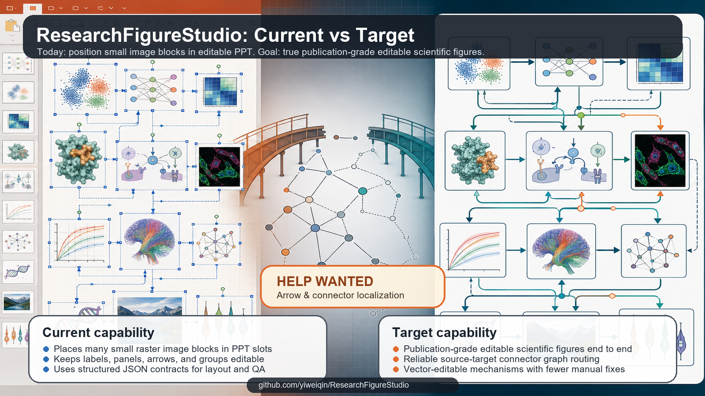

# ResearchFigureStudio

## Summary

ResearchFigureStudio is a paper-to-editable-PPT scientific figure engine and Codex plugin. Paper contracts provide exact labels and scientific relations; generated or user-provided images provide layout and visual style; deterministic code compiles the result into editable PowerPoint objects.

The current workflow is optimized for AI/ML/NLP system figures:

- paper-grounded concept extraction
- reference-primary geometry, style, color, and flow alignment
- 25-50 non-arrow image slots
- `slot_visual_spec.json` for dense mini-scene/image-block planning
- AutoFigure-inspired control candidates and overlays for arrow/source-target binding
- reference-preserving arrow styling/routing reports for softer editable PPT connectors
- reference-constrained orthogonal fallback routing for missing or explicitly fallback-allowed connectors
- optional `--arrow-style-mode aesthetic` for reference-tunnel arrow beautification with curve connectors, halo underlays, and explicit opt-in bundle lane offsets
- multi-candidate image generation through placeholder, Gemini, or Yunwu image2-compatible APIs
- deterministic PPTX composition with editable labels, panels, arrows, connectors, and formulas
- optional Presentations-plugin QA for importing/rendering/inspecting the PPTX without mutating it
- strict validation for no single full diagram, no semantic crop, no vector-only fallback, low blank space, and non-trivial image-block complexity

This repository does not include API keys, papers, reference images, generated outputs, or local run artifacts.

## Current Capability Boundary

ResearchFigureStudio is an early engineering prototype. Its current practical
ability is limited to placing many small generated image blocks into precise
PowerPoint positions, then keeping surrounding labels, arrows, panels, formulas,
and grouping elements editable in PPTX.

It does **not** yet solve the harder goal of generating truly publication-grade,
fully editable scientific figures end to end. The image blocks themselves are
still raster assets, not editable scientific vector objects. The system can
produce a PPTX composition that is easier to manually revise, but it should not
be treated as a finished top-tier-paper figure generator.

## Help Wanted

The most important open problem is reliable arrow and connector localization.
The current implementation now has an initial AutoFigure-inspired
`reference_control_candidates.json` plus `slot_overlay.png` /
`reference_control_overlay.png` workflow, plus reference-preserving
`arrow_style_profile.json`, `selected_arrow_routes.json`, and
`arrow_quality_report.json`. It now includes a conservative orthogonal fallback
router for missing or explicitly fallback-allowed connectors. It is still
fragile for complex scientific diagrams: source-target binding, truly curved
routes, dense bundle routing, dashed loops, and preserving reference-image logic
need stronger methods.

If you have experience with vision-language layout parsing, diagram structure
reconstruction, PowerPoint object routing, graph drawing, or editable scientific
figure generation, guidance and contributions are very welcome.



See [CONTRIBUTING.md](CONTRIBUTING.md) and
[docs/help-wanted.md](docs/help-wanted.md) for concrete contribution areas.

For GPT/Codex agents reproducing or continuing this workflow, start with
[docs/gpt-reproduction-workflow.md](docs/gpt-reproduction-workflow.md).

## Installation

```powershell
git clone https://github.com/yiweiqin/ResearchFigureStudio.git
cd ResearchFigureStudio
python -m pip install --upgrade pip
python -m pip install -e .
rfs doctor --json
```

Optional local OCR support for reference-derived editable text:

```powershell
python -m pip install -e ".[ocr]"
```

Windows with PowerPoint installed gives the best PPTX/PDF/PNG export path. The Python package itself can still generate and validate most intermediate artifacts without external image APIs when using `--asset-mode placeholder`.

## Paper To Editable PPTX

The main product route is:

```powershell
rfs paper-to-editable `
  --paper "C:\path\paper.pdf" `
  --out "output\paper_to_editable" `
  --positive-reference "C:\path\optional_style_reference.png" `
  --json
```

This writes paper-review and image-generation artifacts under `paper_to_image/`, then writes the semantic contract, editable figure program, PPTX, preview, and QA reports under `editable/`. If no image candidate passes the production gates, the workflow stops before creating an official editable deliverable.

For offline engineering validation only, add `--image-asset-mode placeholder --rebuild-asset-mode placeholder --allow-engineering-preview`. This does not create a production-approved result.

## Paper To Image Without PPTX

For the fast “paper to evidence-grounded framework prompt” path, without image generation:

```powershell
rfs fast-framework-prompt `
  --paper "C:\path\paper.pdf" `
  --out "output\fast_result" `
  --deadline 180 `
  --json
```

This writes `paper.md`, `document_model.json`, `extraction_report.json`, `section_summary.md`, `key_evidence.json`, `figure_specification.json`, `contract_completion_report.json`, `image_prompt.md`, `overlay_spec.json`, and `run_report.json`. Fast mode gives the VLM a compact semantic-only task, compiles layout/style deterministically, and applies evidence-gated computer-paper primitives without checking paper names. The contract normalizer tolerates scalar/string entities and `source_id`/`target_id` relation variants, grounds declared terms only through exact paper evidence, repairs uniquely labeled endpoint aliases, and drops unresolved relations into explicit uncertainties instead of rendering dangling or guessed edges. When a VLM already supplies a rich graph, new deterministic entities must occur in an overview caption or connect directly to a VLM-declared entity through non-reference evidence. Credential-free heuristic mode seeds its graph from overview captions and expands only along evidence-supported connected method chains; if no overview seed exists, it selects the largest connected method component. This prevents Related Work examples and unrelated experimental branches from becoming visible framework nodes. Successful document extraction and contracts are cached separately by paper hash. Set `RFS_FAST_FRAMEWORK_MODEL` to override the default `gemini-2.5-flash` model.

Use `rfs inspect-pdf` for parser-only diagnostics. Native PDF blocks are normalized into displayed-page coordinates on rotated pages, and the reading-order pass detects one-, two-, and three-column body layouts while keeping cross-column headings in sequence. The same column pass is applied to OCR lines; when a title fragment creates an invalid three-column hypothesis, detection retries a two-column layout before falling back to one column. Native extraction preserves font size and bold metadata so unnumbered or split-number headings such as `Model Architecture` and `Encoder and Decoder Stacks` still create correct section boundaries. Text quality uses Unicode letters and numbers, and section detection includes common English, Spanish, French, German, Portuguese, Chinese, Japanese, and Korean headings plus localized Figure/Table captions. Cross-parser gating compares supported lexical content rather than raw string order, using CJK character bigrams when whitespace segmentation differs, so normal two-column reordering, equation layout, hidden accessibility text, and native CJK PDFs do not trigger unnecessary OCR. `extraction_report.json` records section, typographic-heading, caption, column, rotation, OCR render DPI, and spacing-repair metrics so assumptions remain auditable. `--ocr-engine auto` prefers RapidOCR when installed, then EasyOCR/PaddleOCR. RapidOCR processes up to three selected pages concurrently at 84 DPI and filters short vertical margin artifacts. The base installation includes `wordninja` for conservative English spacing recovery, while requiring multiple English anchors so non-English Latin words are not split accidentally. Set `RFS_OCR_WORKERS` to override the page-worker count. OCR page selection prioritizes semantic pages and spreads the remaining budget across the document. Long fully scanned papers can continue as explicit `sampled_pages_only` engineering contracts when the OCR sample has high confidence and covers Abstract plus Method; these results always remain `production_ready: false`. Long-paper evidence budgets preserve page-wide coverage before selecting topology definitions and priority sections. OCR model downloads are disabled by default; set `RFS_OCR_ALLOW_DOWNLOAD=1` only for an explicit one-time EasyOCR download. `rfs doctor --json` reports OCR package, worker policy, spacing-repair support, and model readiness.

Run a repeatable fast suite with provider, cache, recall, and timing aggregation:

```powershell
rfs benchmark fast-suite --root benchmarks --out output\benchmarks\fast-suite --planner-mode heuristic --json
```

Run the generated multi-layout PDF extraction stress suite independently of paper semantics:

```powershell
rfs benchmark pdf-suite --out output\benchmarks\pdf-extraction --ocr-engine auto --json
```

It generates 10 deterministic parser cases covering columns, typography, rotation, repeated margins, CJK and Spanish text, hyphenation, formulas, and structured tables. A real OCR engine expands the suite to 16 cases with mixed, skewed, degraded, formula/table, and Spanish scans. Each case writes its fixture, rendered preview, document model, extraction report, assertions, and timing so reading-order or OCR regressions are reproducible without committing third-party PDFs.

Use `paper-to-image` when the required endpoint is a generated raster framework
figure rather than an editable PowerPoint file. The production route performs a
universal evidence-grounded paper review, loads a domain extension, converts
positive references into content-free architecture templates, selects a template,
renders `layout_blueprint.png`, and uses Image2 edit to create and review three
candidates. It never invokes the PPTX compiler.

Offline engineering validation:

```powershell
rfs paper-to-image `
  --paper "C:\path\paper.pdf" `
  --out "output\paper_to_image_placeholder" `
  --planner-mode heuristic `
  --asset-mode placeholder `
  --candidates 2 `
  --review-mode heuristic `
  --ocr-engine off `
  --json
```

Placeholder output is written as `engineering_preview.png`. It is explicitly
ineligible for production delivery and never becomes `selected_image.png`.

Real VLM planning and Image2 generation:

```powershell
rfs paper-to-image `
  --paper "C:\path\paper.pdf" `
  --out "output\paper_to_image" `
  --planner-mode vlm `
  --domain-profile auto `
  --positive-reference "C:\path\reference1.png" `
  --positive-reference "C:\path\reference2.png" `
  --template auto `
  --asset-mode image2 `
  --candidates 3 `
  --aspect-ratio auto `
  --review-mode vlm `
  --repair-rounds 1 `
  --ocr-engine auto `
  --json
```

The main outputs are `paper_review.json`, `review_coverage_report.json`,
`domain_profile.json`, `template_profiles/`, `selected_template.json`,
`layout_blueprint.png`, `figure_specification.json`, `image_prompt.txt`,
`image2_request_manifest.json`, the general and focused-topology critic reports, the `candidates/`
directory, and production-only `selected_image.png`.

To repair a reviewed failed candidate without paying for a new initial candidate
batch, reuse it as the starting image:

```powershell
rfs paper-to-image `
  --paper "C:\path\paper.pdf" `
  --out "output\paper_to_image_repair" `
  --asset-mode image2 `
  --review-mode vlm `
  --repair-source "output\paper_to_image\candidates\candidate_01.png" `
  --repair-rounds 1 `
  --image-retries 0 `
  --json
```

The reused source is rechecked against the current paper contract and Prompt.
Only a failing source triggers one localized Image2 edit. This is useful after
fixing a contract or Prompt bug because it preserves correct regions and avoids
regenerating the initial image from scratch.

Reference-conditioned production generation requires an Image2 edit endpoint.
It defaults to `<API_BASE>/images/edits` and may be overridden with
`RFS_IMAGE_EDIT_URL`. No API key value is written to output artifacts or logs.
If a key was pasted into a chat, issue, or terminal transcript, revoke it and use
a newly rotated key through environment variables before running production.
See [docs/paper-to-image.md](docs/paper-to-image.md) for the review schema,
template contract, production gates, and failure behavior.

Automatic selection includes dedicated `feedback` and `branch` templates.
Compact generation → feedback → refinement loops use `feedback`; shared-trunk
systems with parallel prediction heads use `branch`; true search-tree systems
use `arbor`; simple sequential systems use `linear`. Feedback, branch,
multimodal, and dense candidates also run a focused connector judge that
verifies visible arrow endpoints and rejects shortcuts that bypass required
modules.

## Offline Smoke Test

Use placeholder assets to validate the local pipeline without calling any API:

```powershell
rfs make-framework `
  --paper "C:\path\paper.pdf" `
  --reference "C:\path\reference.png" `
  --out "output\demo_placeholder" `
  --slot-count 25 `
  --slot-source reference-primary `
  --complexity-profile reference-dense `
  --candidates-per-slot 2 `
  --locator-mode heuristic `
  --control-localizer-mode heuristic `
  --arrow-style-mode reference `
  --prompt-plan-mode heuristic `
  --asset-mode placeholder `
  --asset-workers 4 `
  --asset-review-mode heuristic `
  --critic-mode heuristic `
  --text-extractor-mode ocr `
  --ocr-engine paddle `
  --ocr-lang en_ch `
  --json

rfs validate --out "output\demo_placeholder" --json
```

`output/` is intentionally ignored by Git.

## Real VLM + Image Generation

Set API credentials only through environment variables. Do not write keys into source files.

```powershell
$env:API_BASE='https://yunwu.ai/v1'
$env:API_KEY='<your key>'
$env:GEMINI_API_KEY=$env:API_KEY
$env:GEMINI_GEN_IMG_URL='https://yunwu.ai/v1beta/models/gemini-2.5-flash-image:generateContent'
$env:MODEL_VLM='gemini-3-pro-preview-thinking'
$env:RFS_PROMPT_PLANNER_MODEL=$env:MODEL_VLM
$env:RFS_CONTROL_LOCALIZER_MODEL=$env:MODEL_VLM
$env:RFS_IMAGE_MODEL='image-2'
```

For the reference-only image-to-editable-PPT workflow, configure the same VLM
credentials plus the image-generation endpoint:

```powershell
$env:API_BASE='https://your-openai-compatible-provider/v1'
$env:API_KEY='<your key>'
$env:MODEL_VLM='your-vision-language-model'

# Optional model overrides for rfs rebuild-editable.
$env:RFS_REBUILD_LAYOUT_MODEL=$env:MODEL_VLM
$env:RFS_REBUILD_CONTROL_MODEL=$env:MODEL_VLM
$env:RFS_REBUILD_SEMANTIC_MODEL=$env:MODEL_VLM
$env:RFS_PROFESSIONAL_REBUILD_MODEL=$env:MODEL_VLM

# Required only for --asset-mode api slot-level image generation.
$env:GEMINI_API_KEY=$env:API_KEY
$env:GEMINI_GEN_IMG_URL='https://your-provider/v1beta/models/your-image-model:generateContent'
```

Best quality, using VLM layout/control/semantic planning plus generated slot
assets:

```powershell
rfs rebuild-editable `
  --reference "C:\path\figure.png" `
  --out "output\editable_rebuild" `
  --asset-mode api `
  --layout-mode hybrid `
  --control-mode hybrid `
  --text-mode ocr `
  --export-preview
```

Higher-quality scripted mode, where the VLM first writes a controlled Figure DSL
that mimics the best specialized rebuild scripts:

```powershell
rfs rebuild-editable-pro `
  --reference "C:\path\figure.png" `
  --out "output\editable_rebuild_pro" `
  --asset-mode api `
  --asset-policy smart-api `
  --repair-rounds 2 `
  --export-preview
```

The pro workflow writes `professional_rebuild_script.dsl.json`; edit that file
and rerun with `--compile-only` to recompile without rerunning VLM planning or
image-generation API calls. Use `--benchmark-out output\known_good_rebuild` to
write `professional_gap_report.json` against a specialized-script output. Use
`--repair-mode vlm` only when you want the VLM to apply constrained DSL patches
after preview comparison.

In `smart-api` policy, reference crops are only used as image-generation context.
They are not inserted as final PPT assets. Text-like slots are filtered into
editable text, duplicate complex icons reuse one generated asset, and API
failures fall back to placeholders instead of reference crops.

Lower-cost structure check. With `smart-api`, this does not keep reference crops
as final assets; it writes placeholders for visual slots while still producing
the DSL, overlays, and reports:

```powershell
rfs rebuild-editable `
  --reference "C:\path\figure.png" `
  --out "output\editable_rebuild_crop" `
  --asset-mode crop `
  --asset-policy smart-api `
  --layout-mode hybrid `
  --control-mode hybrid
```

Offline smoke test with no API:

```powershell
rfs rebuild-editable `
  --reference "C:\path\figure.png" `
  --out "output\editable_rebuild_placeholder" `
  --asset-mode placeholder `
  --layout-mode heuristic `
  --control-mode heuristic
```

The rebuild workflow writes `reference_geometry_overlay.png` and
`reference_controls_overlay.png` for inspection. If the automatic layout or
arrows need correction, edit `reference_geometry.json` or
`reference_controls.json`, then recompile without another API call:

```powershell
rfs rebuild-editable `
  --reference "C:\path\figure.png" `
  --out "output\editable_rebuild" `
  --compile-only
```

To validate whether VLM planning is improving a given reference image, run the
paired evaluator. It creates `case_heuristic` and `case_vlm` outputs under the
same directory and defaults to `--asset-mode crop` so it does not spend image
generation credits:

```powershell
rfs rebuild-editable-eval `
  --reference "C:\path\figure.png" `
  --out "output\editable_rebuild_eval" `
  --asset-mode crop `
  --export-preview
```

Review `rebuild_vlm_eval_summary.json`,
`case_heuristic/reference_geometry_overlay.png`, and
`case_vlm/reference_geometry_overlay.png` before running a full
`--asset-mode api` rebuild. Each rebuild also writes
`rebuild_vlm_validation_report.json` with layout/control/semantic validation
counts, fallback status, and API request counts.

Recommended real run:

```powershell
rfs make-framework `
  --paper "C:\path\paper.pdf" `
  --reference "C:\path\reference.png" `
  --out "output\paper_reference_image2" `
  --slot-count 40 `
  --slot-source reference-primary `
  --complexity-profile reference-dense `
  --candidates-per-slot 4 `
  --locator-mode vlm `
  --control-localizer-mode hybrid `
  --arrow-style-mode reference `
  --prompt-plan-mode vlm `
  --prompt-plan-workers 8 `
  --asset-mode image2 `
  --asset-workers 6 `
  --asset-retries 3 `
  --asset-review-mode heuristic `
  --critic-mode heuristic `
  --text-extractor-mode ocr `
  --ocr-engine paddle `
  --ocr-lang en_ch `
  --json
```

Use lower worker counts if your API provider rate-limits requests.

## Workflow

```text
input archive -> paper brief -> reference_geometry.json/reference_control_candidates.json ->
slot_overlay.png/reference_control_overlay.png -> reference_controls.json ->
arrow_style_profile.json/selected_arrow_routes.json/arrow_quality_report.json ->
reference_style_profile.json/style_sheet.md -> layout_plan.json -> figure_program.json ->
slot_visual_spec.json -> reference_slot_prompt_brief.json -> slot_prompt_plan.json ->
multi-candidate slot assets -> asset_quality_report.json -> asset_complexity_report.json ->
asset_visual_review.json/contact sheets -> editable_composition.pptx -> PDF/PNG export ->
visual_critic_iter_0.json -> critic_report.md -> validation
```

Optional Presentations-plugin QA can run after validation:

```text
editable_composition.pptx -> rfs presentations-qa -> presentations_plugin_qa_report.json/.md
```

Optional whole-image Creator/Judge refinement can run before conversion:

```text
structured Ground Truth -> Creator Agent candidates -> Online Judge repair feedback ->
Frozen Judge acceptance -> approved_image.png -> existing editable PPTX workflow
```

See [docs/coevolution.md](docs/coevolution.md) for the `rfs coevolve-image` command and Ground Truth contract.
The long-term data, training, evaluation, rollout, and Creator-coordination plan is maintained in [docs/judge_model_training_roadmap.md](docs/judge_model_training_roadmap.md).
User content hierarchy, emphasis, aesthetic, reference-image, and A/B preference criteria can be collected with [docs/aesthetic_ground_truth_questionnaire.md](docs/aesthetic_ground_truth_questionnaire.md).

Key rules:

- The reference image is the source of truth for layout, local visual object choice, color, visual rhythm, and arrow logic when `--slot-source reference-primary` is used.
- The paper provides scientific terminology and concept mapping; it should not override the reference image into a generic template.
- Arrows, connector lines, dashed loops, panel frames, labels, formulas, and critical text are PPT editable objects, not image assets.
- Arrow/control localization is reference-driven: CV detects candidates, overlays label them, optional VLM binding assigns source/target semantics, and the PPT compiler renders editable connectors.
- Arrow styling is reference-preserving: it may soften line caps, assign bundle IDs, vary widths/dashes, and report aesthetics, but it must not replace reference-image flow logic with a generic router.
- Obstacle-aware routing is fallback-only: it may synthesize orthogonal paths for missing routes or `route_policy=fallback_reroute_allowed`, but it must not rewrite reference-locked paths.
- Aesthetic mode is experimental: `--arrow-style-mode aesthetic` may offset reference-locked arrows only when the route explicitly opts in, only within `reference_tunnel_percent`; it records the original path and must keep `reference_tunnel_preserved=true`.
- Normal non-legend slots should be dense mini scientific scenes/cards with layered objects and micro-details, not simple centered icons.
- Generated images are inserted with no semantic cropping.
- The Presentations plugin is QA-only in this project. It can import/render a PPTX, extract layout JSON, and expose renderer/font/connector drift, but RFS remains the authoritative compiler for reference-locked geometry and connector-heavy figures.

Optional arrow-beautification pass:

```powershell
rfs make-framework `
  --paper "C:\path\paper.pdf" `
  --reference "C:\path\reference.png" `
  --out .\output\aesthetic_experiment `
  --slot-count 40 `
  --slot-source reference-primary `
  --control-localizer-mode hybrid `
  --arrow-style-mode aesthetic `
  --prompt-plan-mode vlm `
  --asset-mode image2
```

For publication-safe comparison, keep both `--arrow-style-mode reference` and
`--arrow-style-mode aesthetic` outputs. Use the aesthetic version only when the
small reference-tunnel deviations improve readability without changing the
reference image's flow logic.

Optional Presentations-plugin QA for an existing output:

```powershell
rfs presentations-qa `
  --out "output\paper_reference_image2" `
  --scale 2 `
  --json
```

Optional QA during a new run:

```powershell
rfs make-framework `
  --paper "C:\path\paper.pdf" `
  --reference "C:\path\reference.png" `
  --out "output\paper_reference_image2" `
  --slot-source reference-primary `
  --asset-mode image2 `
  --presentations-qa `
  --json
```

If the plugin reports `autoRouteConnectorPx failed`, treat that as a QA signal,
not as a reason to let the plugin rewrite the figure. The PPTX generated by RFS
remains the source of truth.

## Output Contract

A valid image-rich framework run should include:

- `input_manifest.json`
- `paper_brief.md` / `paper_brief.json`
- `reference_geometry.json`
- `reference_control_candidates.json`
- `slot_overlay.png`
- `reference_control_overlay.png`
- `reference_controls.json`
- `reference_text_geometry.json`
- `text_program.json`
- `ocr_text_quality_report.json`
- `text_alignment_report.json`
- `arrow_style_profile.json`
- `selected_arrow_routes.json`
- `arrow_quality_report.json`
- `reference_style_profile.json`
- `style_sheet.md`
- `layout_plan.json`
- `figure_program.json`
- `slot_visual_spec.json`
- `reference_slot_prompt_brief.json`
- `slot_prompt_plan.json`
- `prompts.md`
- `reference_slot_crops/<slot_id>.png`
- `assets/*.png` with at least 25 selected non-arrow image assets
- `asset_candidates/*/candidate_*.png`
- `asset_quality_report.json`
- `asset_complexity_report.json`
- `asset_visual_review.json`
- `asset_contact_sheet.png`
- `asset_candidate_contact_sheet.png`
- `editable_composition.pptx`
- `review.pdf` and `final_600dpi.png` when local export is available
- `visual_critic_iter_0.json`
- `alignment_review.md`
- `critic_report.md`

Optional QA outputs:

- `presentations_plugin_qa_report.json`
- `presentations_plugin_qa_report.md`
- `presentations_plugin_qa_workspace/` when using the default workspace

Run validation:

```powershell
rfs validate --out "output\paper_reference_image2" --json
python skills\research-figure-studio\scripts\validate_framework_outputs.py "output\paper_reference_image2"
```

## Codex Skill

This repository includes the Codex skill under:

```text
skills/research-figure-studio
```

To install it locally into Codex:

```powershell
$dst = Join-Path $env:USERPROFILE ".codex\skills\research-figure-studio"
if (Test-Path $dst) { Remove-Item -Recurse -Force $dst }
Copy-Item -Recurse "skills\research-figure-studio" $dst
```

The skill documents the full research-figure workflow and includes the standalone framework-output validator.

## Development

```powershell
python -m compileall -q rfs
python -m unittest discover -s tests -q
python -m py_compile skills\research-figure-studio\scripts\validate_framework_outputs.py
```

## Repository Hygiene

Do not commit:

- `output/`
- papers, manuscripts, private datasets, or user reference images
- generated PPTX/PDF/PNG/JPG/SVG assets
- `.env` files or API keys
- cache folders such as `__pycache__/` or `*.egg-info/`

## License

MIT License. See [LICENSE](LICENSE).
