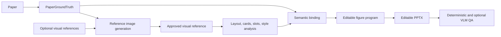

# Summary

ResearchFigureStudio has one product goal: turn a paper into a scientifically faithful, editable PowerPoint figure. Paper-derived contracts own semantics; generated or supplied images own layout and visual style; deterministic code owns PPTX composition and validation.

## Product architecture



The semantic path never passes through OCR alone. OCR may help recover geometry from an image, but exact labels, entity IDs, relations, and evidence links are restored from `paper_review.json` and `figure_specification.json` before compilation.

## Repository map

```text
.codex-plugin/                 Codex plugin manifest
skills/research-figure-studio Thin agent instructions; no machine paths
rfs/                           Installable, agent-independent Python engine
  contracts/                   Paper semantic contracts and stable schemas
  providers/                   VLM and external model integrations
  analysis/                    Paper, layout, and text analysis entry points
  planning/                    Paper and rebuild planning entry points
  generation/                  Reference and slot-asset generation entry points
  workflows/                   Product-level workflow entry points
  composition/                 PPTX compilation and fallback preview rendering
  evaluation/                  Deterministic rebuild quality checks
  paper_to_image/              Paper review, grounding, planning, image candidates
  coevolution/                 Experimental creator/judge research
  paper_to_editable.py         Product workflow orchestrator
  semantic_contract.py         Paper truth → editable object bindings
  editable_rebuild.py          Reference image → editable figure program/PPTX
  ppt_compiler.py              Deterministic PowerPoint renderer
  rebuild_visual_critic.py     Deterministic rebuild QA
tests/                         Unit, integration, and future end-to-end tests
benchmarks/                    Real product acceptance cases and metrics
experiments/                   Research prototypes and historical scripts
docs/                          Architecture, workflows, decisions, roadmaps
scripts/                       Reusable installation/maintenance scripts only
```

The current package remains under `rfs/` to avoid a disruptive all-at-once move. A future `src/rfs/` migration should be a packaging-only change after the paper-to-editable contracts and benchmarks stabilize.

## Authority model

| Concern | Source of truth |
|---|---|
| Scientific entities and exact labels | `paper_review.json`, `figure_specification.json` |
| Scientific relations and evidence | Paper semantic contract |
| Paper-to-image draft node and connector geometry | `layout_blueprint.json.semantic_plan` |
| Direct paper-to-PPT node and connector geometry | `figure_program.json` compiled from the same semantic plan |
| Layout, visual rhythm, palette, object style | Approved generated/user reference image |
| Editable object geometry | `figure_program.json` |
| PowerPoint rendering | `ppt_compiler.py` |
| Production eligibility | Candidate, semantic, visual, and PPTX validation reports |

## Stable workflow boundaries

- `fast-framework-prompt`: produces the cached semantic contract and prompt; `--editable-ppt` additionally emits a fast native-shape PPTX without image generation.
- `paper-to-image`: produces reviewed visual candidates and paper-grounding artifacts; it never creates PPTX.
- `rebuild-editable`: reconstructs an image; it can optionally accept a paper semantic contract.
- `paper-to-editable`: runs both stages and requires a production-approved image unless engineering preview use is explicitly enabled.
- Plugin skill: selects and invokes workflows; it does not contain the engine or hardcoded repository paths.
- Benchmark layer: independently scores paper-to-image scientific/visual quality and image-to-PPT fidelity/editability.

## Production rules

- Failed candidates never become `selected_image.png`.
- Engineering previews are opt-in and never production-approved.
- Critical text and relations remain editable PPT objects.
- Image/OCR guesses cannot override paper-grounded terminology or relation endpoints.
- Deterministic completion is graph-scoped: rich VLM contracts only gain overview-local or directly connected evidence-backed entities, while heuristic contracts grow from overview seeds or the largest connected method chain. Late appendix-only diagram labels, ungrounded innovations, and input shortcuts that bypass an explicit intermediate node are removed before planning.
- `semantic_blueprint.py` compiles 2-16 visible contract entities into normalized graph geometry. It ranks DAG layers, places source-only conditioning nodes immediately before their targets, assigns distinct fan-in/fan-out ports, routes skip-layer edges around intermediate nodes, and sends feedback loops through an outer lane.
- Benchmark entity matching uses both label fidelity and relation consistency so relation labels and variable suffixes cannot steal mappings from real contract entities.
- VLM correction is optional and bounded; deterministic reports remain available offline.
- Historical sample-specific scripts stay under `experiments/legacy_reference_rebuilds/` and are not imported by production code.

## Planned package refinement

As interfaces stabilize, split `rfs/` internally into `contracts`, `providers`, `analysis`, `planning`, `generation`, `composition`, `evaluation`, and `workflows`. Do this incrementally with compatibility imports, not as a mass rename that obscures behavior changes.
